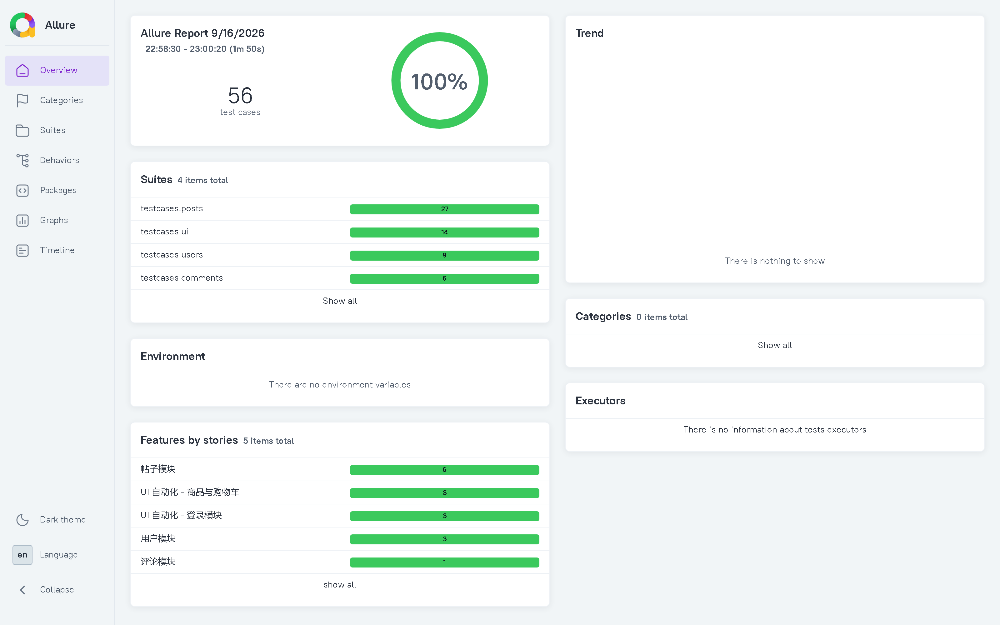
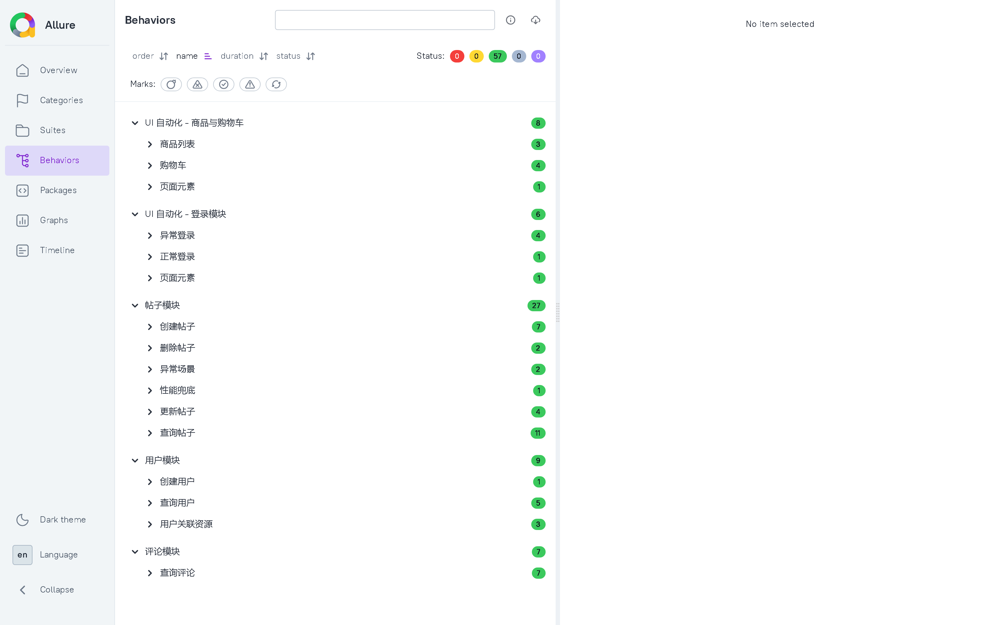
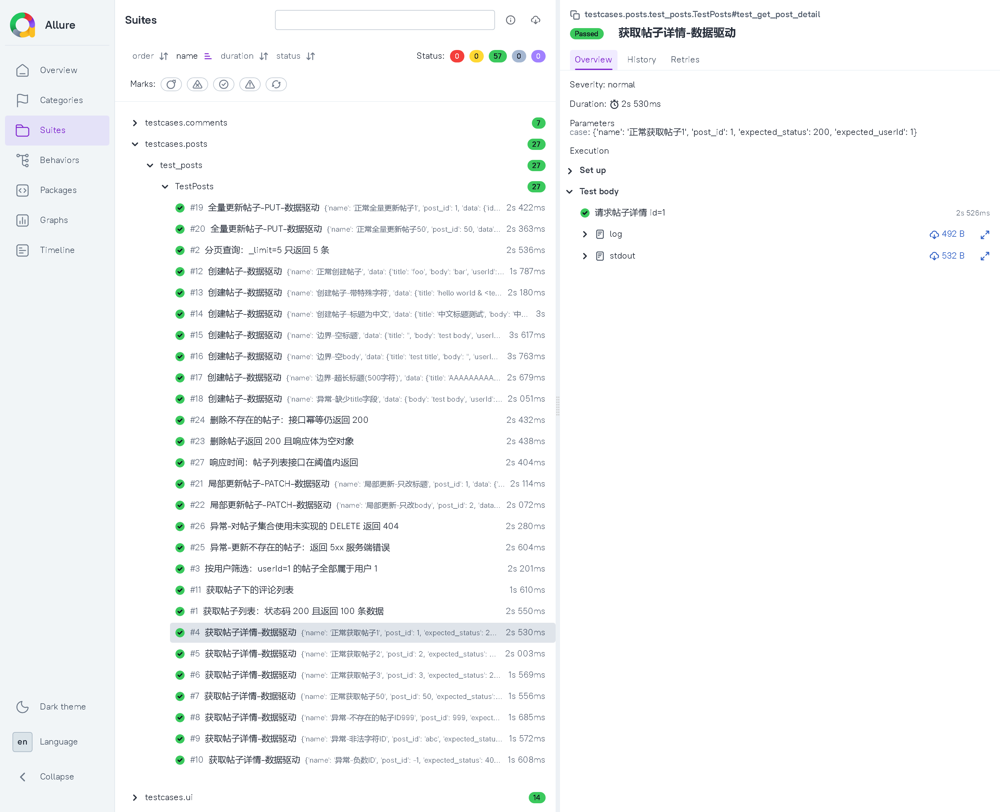
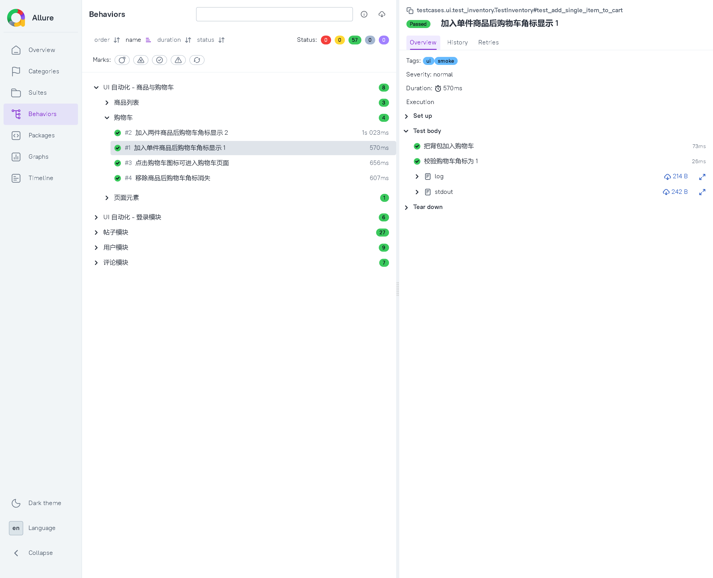
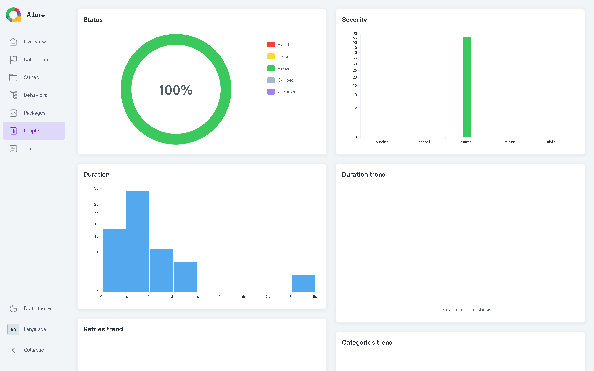
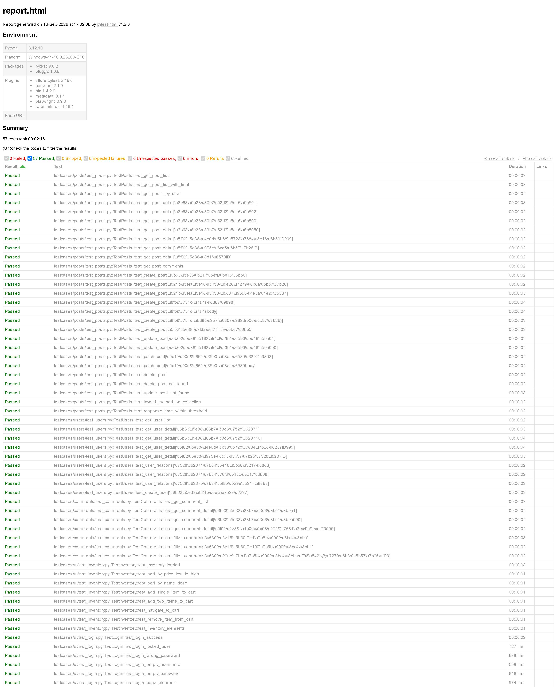

# 接口 + UI 自动化测试框架

一个从零搭建的 **接口自动化 + UI 自动化** 测试框架，分层清晰、数据驱动、带完整报告体系与 CI 流水线。

- **接口自动化**：Python + Pytest + requests，覆盖 JSONPlaceholder 公开 API 的 `/posts`、`/users`、`/comments` 三大模块
- **UI 自动化**：Playwright + Page Object Model，覆盖 SauceDemo 电商站点的登录、商品列表、购物车
- **测试规模**：**56 条用例全部通过**（42 接口 + 14 UI），单次全量运行约 110 秒

> 📌 **所有命令都请先 `cd` 到项目根目录（含 `pytest.ini` 的那一层）再执行**，
> 例如 `cd D:\project\api_test_project`，否则测试配置不会被加载，且会生成空报告。
> 详见 [快速开始](#快速开始)。

## 报告预览

### Allure 概览：56 条用例，100% 通过



### 按功能分组（Behaviors）

feature / story 两级分组，绿色为通过数：



### 用例详情：步骤树 + 数据驱动参数

`@allure.step` 会把用例内部步骤展开成树；数据驱动用例的参数也会显示出来：



### UI 用例详情：带标记与日志附件

UI 用例带 `ui` / `smoke` 标记，步骤失败时自动挂全页截图：



### 统计图表



### pytest-html 轻量报告



## 技术栈

| 技术 | 用途 |
| --- | --- |
| Python 3.12 | 编程语言 |
| Pytest | 测试框架 |
| requests | HTTP 请求库（接口层） |
| Playwright | 浏览器自动化（UI 层） |
| Allure | 测试报告（步骤追踪 + 失败截图） |
| pytest-html | 轻量 HTML 报告 |
| PyYAML | 测试数据管理（数据驱动） |
| GitHub Actions | 持续集成 |

## 项目结构

```
api_test_project/
├── common/                          # 框架核心层（与业务无关的通用能力）
│   ├── base_api.py                 #  HTTP 客户端封装：Session 复用 + 日志 + 网络重试
│   ├── config.py                   #  配置管理：环境变量 > config.yaml > 默认值
│   ├── logger.py                   #  日志：控制台 + 按天切分文件
│   ├── assert_util.py              #  断言封装：状态码/字段/契约/性能
│   └── data_util.py                #  数据加载：YAML/JSON + 可读用例 id
├── config/
│   └── config.yaml                 # 多环境配置（含 UI 配置）
├── data/                            # 测试数据（数据驱动）
│   ├── posts_data.yaml
│   ├── users_data.yaml
│   └── comments_data.yaml
├── testcases/                       # 测试用例层
│   ├── posts/                      #  帖子模块
│   │   ├── posts_api.py            #   业务 API 封装
│   │   └── test_posts.py           #   测试用例
│   ├── users/                      #  用户模块
│   ├── comments/                   #  评论模块
│   └── ui/                         #  UI 自动化
│       ├── pages/                  #   Page Object：页面元素与操作封装
│       │   ├── base_page.py        #    页面基类：通用操作 + 截图
│       │   ├── login_page.py       #    登录页
│       │   └── inventory_page.py   #    商品列表页
│       ├── conftest.py             #  browser/context/page 生命周期 + 登录态复用
│       ├── test_login.py           #  登录用例（6 条）
│       └── test_inventory.py       #  商品与购物车用例（8 条）
├── logs/                            # 运行日志（按天切分，保留 7 天）
├── reports/                         # 报告输出（allure-results / report.html / 失败截图）
├── docs/                            # 文档与实证
│   ├── ai-efficiency.md            #  AI 提效实测报告（三层漏斗 + 采纳率）
│   ├── screenshots/                #  报告截图（README 引用）
│   └── tools/                      #  实验脚本（可复现）
├── .github/workflows/ci.yml         # CI：接口 + UI 双 job + Allure 汇总
├── conftest.py                      # 全局 fixture 与失败日志
├── pytest.ini                       # pytest 配置
└── requirements.txt
```

## 架构设计：四层分离

```
        ┌──────────────────────────────────────┐
        │  测试用例层  test_posts.py            │  只做「调接口 + 断言」
        └────────────────┬─────────────────────┘
                         │ 调用
        ┌────────────────▼─────────────────────┐
        │  业务 API 层  posts_api.py            │  按模块封装具体接口
        └────────────────┬─────────────────────┘
                         │ 继承
        ┌────────────────▼─────────────────────┐
        │  基础 API 层  base_api.py             │  Session / 日志 / 重试
        └────────────────┬─────────────────────┘
                         │ 发送
        ┌────────────────▼─────────────────────┐
        │  被测服务  JSONPlaceholder API        │
        └──────────────────────────────────────┘

        数据层  data/*.yaml  ←──  通过 parametrize 注入用例
```

**为什么这样分？**

- 接口地址或字段变了 → 只改业务 API 层，用例不动
- 加统一鉴权 / 日志 / 重试 → 只改基础 API 层，全模块生效
- 加测试数据 → 只改 YAML，不碰代码

UI 层同样遵循这条思路：**页面改了只改 Page Object，用例不动**。

## 测试用例设计

### 接口自动化（42 条）

| 模块 | 用例数 | 覆盖场景 |
| --- | --- | --- |
| 帖子 `/posts` | 19 | 列表/详情/筛选/评论、创建（含空值、超长、缺字段）、PUT/PATCH、删除、404/5xx 异常、性能兜底 |
| 用户 `/users` | 10 | 列表、详情、关联资源（posts/albums/todos）、创建 |
| 评论 `/comments` | 5 | 列表、详情、按 postId / email 筛选 |

### UI 自动化（14 条）

| 模块 | 用例数 | 覆盖场景 |
| --- | --- | --- |
| 登录 | 6 | 登录成功、锁定账号、密码错误、账号为空、密码为空、元素可见性 |
| 商品与购物车 | 8 | 商品加载、价格/名称排序、加入购物车（1 件/2 件）、移除商品、跳转购物车、元素可见性 |

> 合计 **56 条**用例（42 接口 + 14 UI）。

### 多维度断言

只校验状态码是 **不合格** 的测试——服务端返回 200 但数据是错的，用例一样会"通过"。本项目做三层校验：

1. **状态码断言** — `assert_status_code`
2. **契约断言** — `assert_schema`：必需字段是否齐全，防止字段被误删
3. **业务断言** — `assert_field_equals` / `assert_in`：值是否正确

例如「按用户筛选帖子」不只看 200，还会遍历每一条确认 `userId` 真的等于查询值——参数没生效这种 bug 才跑不掉。

## 快速开始

### 1. 克隆项目

```bash
git clone https://github.com/Youknowwho666/api-automation-test.git
cd api-automation-test
```

### 2. 创建虚拟环境

```bash
python -m venv venv

# Windows
venv\Scripts\activate

# Linux / macOS
source venv/bin/activate
```

### 3. 安装依赖

```bash
pip install -r requirements.txt -i https://mirrors.aliyun.com/pypi/simple/

# UI 测试需要额外安装浏览器（首次执行）
python -m playwright install chromium
```

### 4. 运行测试

> ⚠️ **务必先 `cd` 到项目根目录（含 `pytest.ini` 的这一层）再执行命令。**
> `pytest.ini` 不会被上层目录加载，在错误的目录运行会导致 `addopts`、`markers`、
> `testpaths` 全部失效，并生成一份**空报告**（Allure 页面显示 `0 test cases`）。
> 若在错误目录运行，项目外层已放置守卫 `conftest.py`，会直接报错终止并提示正确路径。

```bash
cd D:\project\api_test_project
python -m pytest
allure serve reports/allure-results
```

常用变体：

```bash
# 只跑接口 / 只跑 UI（同样先 cd 到项目根目录）
python -m pytest testcases/posts testcases/users testcases/comments
python -m pytest testcases/ui

# 只跑冒烟用例（核心链路）
python -m pytest -m smoke

# 网络不稳定时失败自动重跑
python -m pytest --reruns 2 --reruns-delay 3
```

### 5. 查看报告

```bash
# 方式一：轻量 HTML（pytest-html 自动生成）
#   直接双击打开 reports/report.html

# 方式二：Allure（推荐，含步骤树与失败截图）
allure serve reports/allure-results
```

> 💡 Allure 报告**必须通过 HTTP 服务查看**（即 `allure serve` 或
> `allure generate` + 本地静态服务）。直接双击 `allure-report/index.html`
> 会因浏览器 CORS 限制导致页面空白、提示 `Failed to fetch`。
>
> 💡 每轮测试开始前，`conftest.py` 会自动清空 `reports/allure-results`，
> 因此**不需要**手动删除旧结果，报告数据也不会跨轮次累积。

## 框架亮点

### 1. 配置管理：三级优先级

`common/config.py` 支持 **环境变量 > config.yaml > 默认值**，切换环境不用改代码：

```bash
# 换个测试环境跑，一行命令搞定
TEST_BASE_URL=https://staging.example.com python -m pytest
```

### 2. 网络重试：只重试网络层，不重试业务层

这是本项目的一个关键设计决策。`Retry` 配置为 `status=0` + `read=2`：

- **网络层错误**（连接失败、读超时）→ 自动重试，避免环境抖动造成的假失败
- **业务层 4xx/5xx** → 原样返回给用例断言

如果让 urllib3 对 500 也重试，`assert_status_code(response, 500)` 这类用例会直接抛 `ResponseError`——**重试机制反过来掩盖了被测系统真实的错误**。

### 3. 登录态复用：UI 用例不再重复登录

`testcases/ui/conftest.py` 用 **session 级 fixture** 登录一次并保存 `storageState`，后续用例直接加载：

```python
@pytest.fixture(scope="session")
def logged_in_context(browser):
    page = context.new_page()
    LoginPage(page).open().login(STANDARD_USER, VALID_PASSWORD)
    context.storage_state(path="reports/auth_state.json")  # 存登录态
    ...

@pytest.fixture()
def logged_in_page(logged_in_context):
    page = logged_in_context.new_page()   # 直接就是已登录状态
    yield page
```

登录流程从「每条用例跑一次」变成「整个会话跑一次」，UI 套件执行时间大幅下降。

**但复用登录态有个坑**：上下文是 session 级的，购物车这类状态会被带入下一条用例。
所以每条购物车用例开始前都会调 `clear_cart()` 复位——用例必须能独立运行，不能依赖执行顺序。

### 4. 失败自动留痕

- 接口失败 → 日志落盘 `logs/test.log`，带请求 URL、入参、状态码、耗时
- UI 失败 → 自动全页截图，直接挂进 Allure 报告
- 所有断言报错都带 **期望值 vs 实际值 + 完整响应体**，不用复现就能定位

### 5. CI 流水线

`.github/workflows/ci.yml` 分三个 job：

| Job | 说明 |
| --- | --- |
| `api-test` | 跑接口套件，上传 pytest-html + Allure 原始结果 |
| `ui-test` | 安装 Playwright 浏览器后跑 UI 套件（依赖 api-test 通过） |
| `allure-report` | 合并两端结果，生成可浏览的 Allure HTML |

触发时机：push/PR 到 main、每天 09:00 定时回归、手动触发。

### 6. AI 提效：三层漏斗验收，采纳率 50%

这个项目里的用例不是全部手写的。我让 AI 批量生成候选用例，再用**三层漏斗**逐条验收，
得出的真实数据（详见 [`docs/ai-efficiency.md`](docs/ai-efficiency.md)）：

| 环节 | 结果 |
| --- | --- |
| AI 生成候选 | 20 条 |
| L1 可执行（能跑通） | 15 条 → **75.0%** |
| L2 断言有效（契约 + 业务值） | 10 条 → **50.0%** |
| L3 变异杀死（注入缺陷能抓） | 10 条 → **50.0%** |
| **最终采纳** | **10 条（净新增 9 条）→ 采纳率 45%~50%** |

**三层漏斗是怎么定的：**

1. **L1 可执行性** —— 真跑一遍，拦住 AI 幻觉（臆造字段、臆造状态码、臆造响应结构）。
2. **L2 断言有效性** —— 人工审断言，只判 `status_code == 200` 的一律打回。
3. **L3 变异杀伤率** —— 往业务 API 层**真的注入 4 处缺陷**，看用例会不会红。

L3 不是嘴上说说，实测结果如下：

| 变异体 | 注入的缺陷 | 用例是否抓住 |
| --- | --- | --- |
| M1 | 筛选参数 `userId` 被静默忽略 | ✅ 失败 |
| M2 | 更新接口丢弃 `title` 字段 | ✅ 失败 |
| M3 | 分页参数 `_limit` 被丢弃 | ✅ 失败 |
| M4 | 详情接口固定返回 `id=1` | ✅ 失败 |
| M5 | 基线对照（不改代码） | ✅ 通过 |

**变异杀伤率 4/4 = 100%。**

排查 AI 产出时发现，淘汰的一半都是「断言不够硬」——AI 很会写能跑通的用例，
但不擅长判断断言有没有业务价值。所以**效率提升来自 AI 生成，质量守住靠 L2/L3 两道人工关卡**。

复现命令：

```bash
python docs/tools/ai_funnel.py       # 三层漏斗统计
python docs/tools/mutation_demo.py   # 变异测试实证（跑完自动还原源码）
```

## 被测站点

| 层次 | 目标 | 说明 |
| --- | --- | --- |
| 接口 | [JSONPlaceholder](https://jsonplaceholder.typicode.com) | 免费公开 RESTful API，无需认证 |
| UI | [SauceDemo](https://www.saucedemo.com) | 公开电商练习站点，含 standard_user / locked_out_user 等测试账号 |

## 环境要求

- Python 3.10+
- 查看 Allure 报告需本地安装 [Allure 命令行](https://allurereport.org/docs/install/)（可选）
